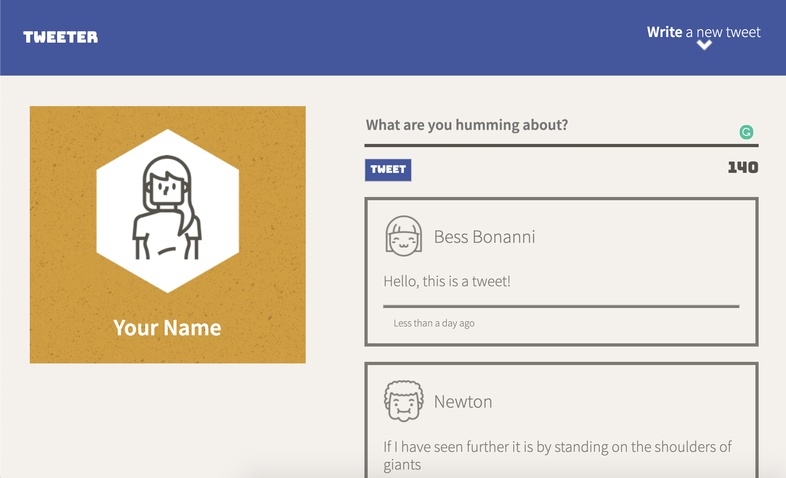
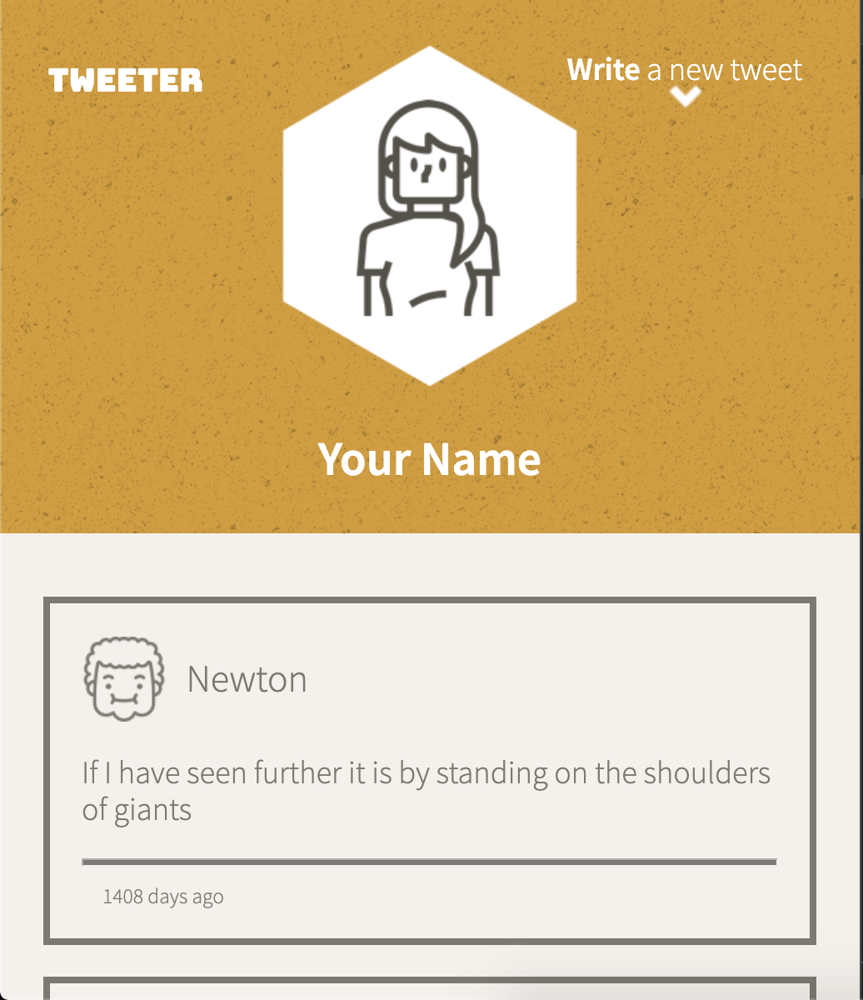
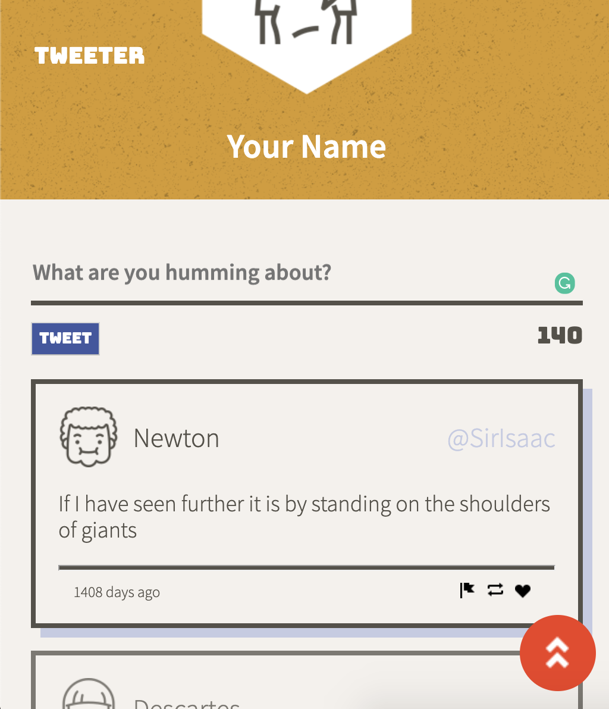

# Tweeter Project

Tweeter is a simple, single-page Twitter clone application. It allows users to post tweets to the server without the need to reload the page, as well as to view the "feed" of all tweets.

**BEWARE**: This app was published for learning purposes and it is not intended for use in production-grade software.

This project was created and published by me as part of my learnings at Lighthouse Labs.

## Final Product

- Node, Express, MongoDB in the back-end
- HTML, AJAX, jQuery, and JavaScript for front-end functionality
- Responsive CSS with Flexbox
- Create tweets by clicking the "Write tweet" button which reveals a hidden compose box
- Don't lose focus with tweet highlights for tweets that are in focus
- Easily scroll back to the top of the site with a convenient "Scroll to top" button

## Dependencies

- Express
- Node 5.10.x or above

## Getting Started

1. Fork this repository, then clone your fork of this repository.
2. Install dependencies using the `npm install` command.
3. Start the web server using the `npm run local` command. The app will be served at <http://localhost:8080/>.
4. Go to <http://localhost:8080/> in your browser.